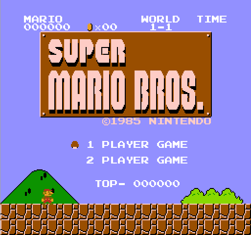
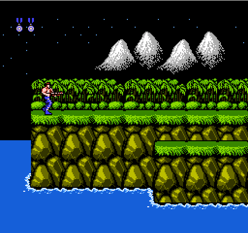
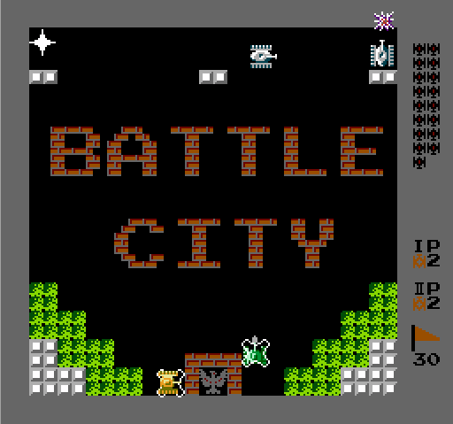
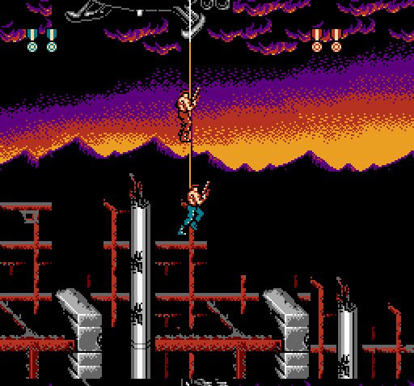
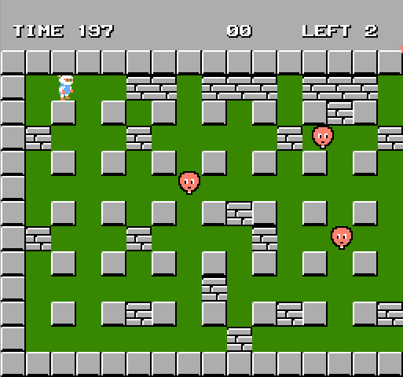
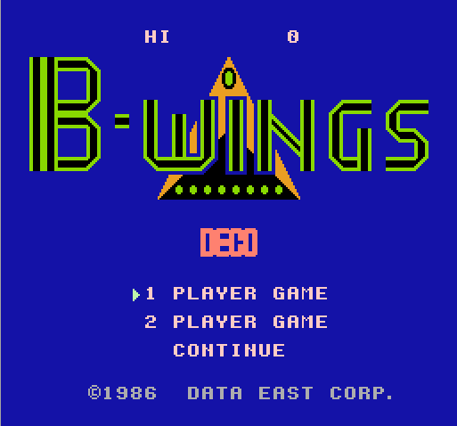
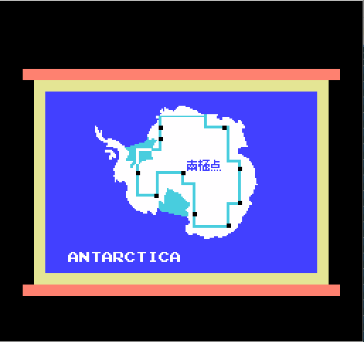
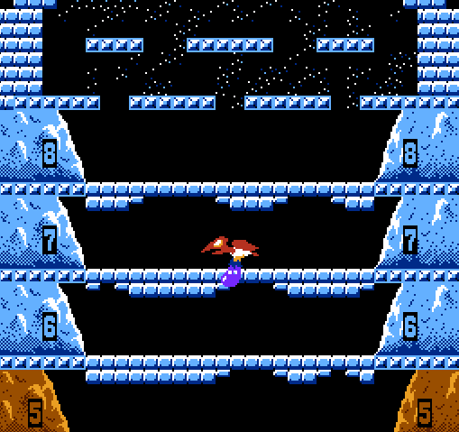
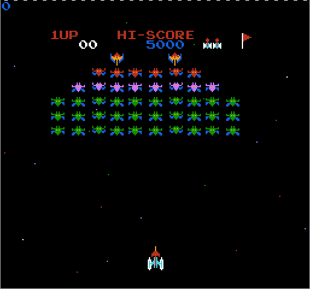
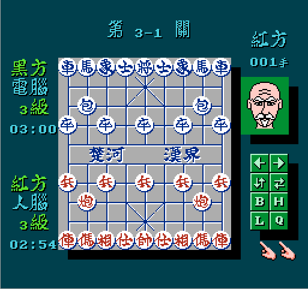

Hack NES Emulator
=================

# Develop Environment
gcc 7.5.0
CMake 3.21

# Requirement

- glog
- gflags
- sfml

# Support
Mapper:
* NROM 0
* SxROM 1
* UxROM 2
* CNROM 3
* MMC3 4
* AxROM 7
* GxROM 66

# Reference

* https://wiki.nesdev.org/w/index.php?title=Nesdev_Wiki
* http://fms.komkon.org/EMUL8/NES.html

# Screensnaps

and etc.
